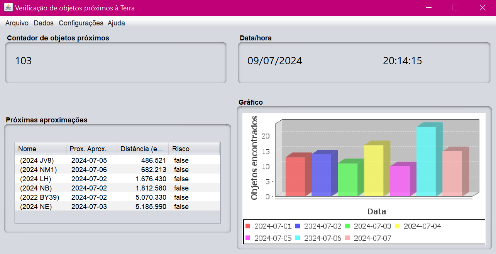

O projeto utiliza a API Asteroids - NeoWs.

##Funcionamento
1. Execute o script de criação do bd (criacaobdProjetoNEO.sql)
2. Crie a chave da sua API no site  https://api.nasa.gov/
3. Copie e cole a chave no arquivo API.

##Tela

